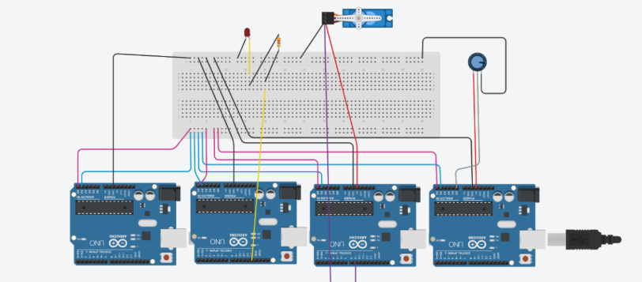
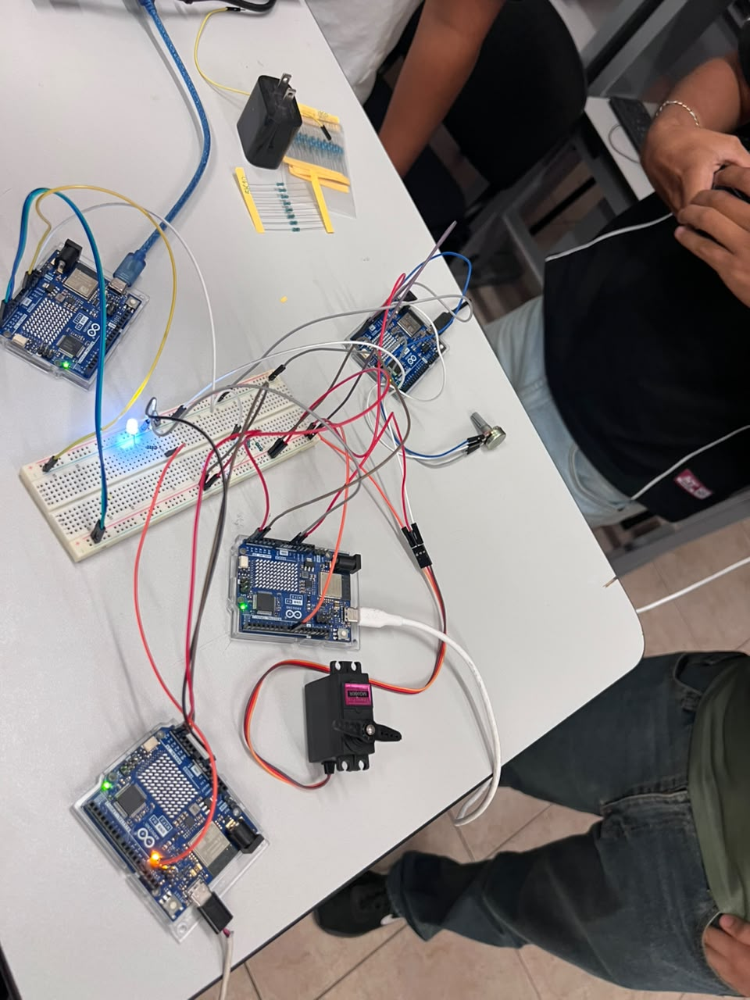

# Comunicación I2C entre 4 Arduinos

## Descripción

Esta práctica tiene como propósito implementar la comunicación mediante el bus I2C entre un Arduino maestro y tres Arduinos esclavos, programados en Arduino UNO R4 WiFi.

El maestro se comunica con los esclavos a través de las líneas SDA (A4) y SCL (A5), compartiendo tierra (GND) común entre las cuatro placas. Cada esclavo se identifica con una dirección distinta (0x08, 0x09 y 0x0A) y cumple una función específica: controlar un LED, mover un servomotor o leer un potenciómetro. La temporización del maestro se realiza mediante `millis()`, sin utilizar `delay()`, permitiendo que el programa atienda el Monitor serie y consulte al potenciómetro sin bloquearse.

## Objetivos

* Comprender el funcionamiento del bus I2C mediante la comunicación maestro-esclavo.
* Armar un bus I2C compartiendo las líneas SDA y SCL entre varios dispositivos.
* Asignar direcciones únicas a cada esclavo y evitar conflictos de direccionamiento.
* Programar el envío y la recepción de datos entre el maestro y los esclavos.
* Utilizar `millis()` para realizar una temporización no bloqueante en el maestro.
* Verificar el resultado de `endTransmission()` y `requestFrom()` para detectar esclavos que no responden.
* Identificar los ajustes necesarios al migrar el código de un Arduino UNO R3 a un UNO R4 WiFi.

## Herramientas y material utilizado

* 4 Arduino UNO R4 WiFi.
* Arduino IDE.
* Tinkercad (simulación del circuito).
* 1 protoboard (Breadboard Small).
* 1 LED.
* 1 resistencia de 470 Ω (ajustada para el R4).
* 1 micro servo.
* 1 potenciómetro.
* 2 resistencias de 4.7 kΩ (pull-up en SDA y SCL, necesarias en el R4).
* Cables de conexión (jumpers).
* Librerías `Wire` y `Servo`.

## Diagrama

El diagrama muestra las conexiones del bus I2C entre las cuatro placas, así como el LED, el servomotor y el potenciómetro conectados a sus respectivos esclavos.

[Ver carpeta Diagramas](diagrama)

## Código

El programa se divide en cuatro sketches independientes:

* **Maestro**: controla la comunicación, pide el valor del potenciómetro al esclavo 3, calcula el ángulo y se lo envía al esclavo 2; además atiende el Monitor serie para encender o apagar el LED del esclavo 1.
* **Esclavo 1 (0x08)**: recibe una orden del maestro y enciende o apaga un LED.
* **Esclavo 2 (0x09)**: recibe un ángulo del maestro y mueve un servomotor.
* **Esclavo 3 (0x0A)**: lee un potenciómetro y envía su valor al maestro cuando este lo solicita.

El código incluye los ajustes necesarios para el Arduino UNO R4 WiFi: espera del puerto serie USB nativo, resistencia de 470 Ω para el LED y resistencias pull-up físicas en SDA y SCL.

[Ver código maestro](codigos/codigo-maestro.ino)

[Ver código Esclavo 1](codigos/esclavo1.ino)

[Ver código Esclavo 2](codigos/esclavo2.ino)

[Ver código Esclavo 3](codigos/esclavo3.ino)

## Reporte

El reporte contiene la explicación del funcionamiento del sistema, la metodología utilizada, las consideraciones específicas para el Arduino UNO R4 WiFi, el análisis de los resultados y las conclusiones obtenidas durante la práctica.

[Ver Reporte](reporte/Reporte_I2C_4_Arduinos.pdf)

## Resultados

Durante las pruebas, la comunicación I2C funcionó correctamente entre el maestro y los tres esclavos. El maestro solicitó el valor del potenciómetro al esclavo 3 cada 500 ms, lo convirtió a un ángulo entre 0° y 180°, y lo envió exitosamente al esclavo 2, que movió el servomotor en consecuencia.

El envío de los caracteres '1' y '0' desde el Monitor serie permitió encender y apagar el LED controlado por el esclavo 1 sin inconvenientes. El maestro reportó correctamente en el Monitor serie tanto las lecturas del potenciómetro como los casos en los que algún esclavo no respondía.

Se identificaron y corrigieron dos errores comunes durante el armado: una resistencia colocada con ambas terminales en la misma columna de la protoboard, y una lectura múltiple del mismo dato I2C dentro de una sola expresión.

## Video

El video muestra el funcionamiento del bus I2C entre las cuatro placas, incluyendo el control del LED, el movimiento del servomotor según el potenciómetro y la respuesta del sistema ante un esclavo desconectado.

[Ver video](https://youtu.be/aFCSiKvfGaE)

[Ver carpeta Video](video)

## Conclusiones

El bus I2C permite comunicar varios dispositivos usando solo dos líneas (SDA y SCL) más tierra común, sin necesitar pines adicionales al agregar un nuevo esclavo, solo una dirección diferente.

Se comprobó que cada esclavo debe tener una dirección única, ya que direcciones repetidas provocan que ambos dispositivos respondan al mismo tiempo y los datos se corrompan. También se confirmó que el maestro es quien controla la comunicación, decidiendo con quién habla y cuándo, mientras que los esclavos solo responden cuando se les llama.

El uso de `millis()` en lugar de `delay()` permitió que el maestro atendiera el Monitor serie y consultara al potenciómetro sin bloquear la ejecución del programa. Asimismo, la verificación del resultado de `endTransmission()` y `requestFrom()` permitió detectar cuando un esclavo no respondía, evitando que el sistema se congelara.

Finalmente, migrar el código del Arduino UNO R3 al UNO R4 WiFi implicó ajustes importantes: agregar una espera al puerto serie USB nativo, cambiar el valor de la resistencia del LED y añadir resistencias pull-up físicas en las líneas SDA y SCL, ya que estas placas no las incorporan de forma interna con la misma fuerza que el R3.
